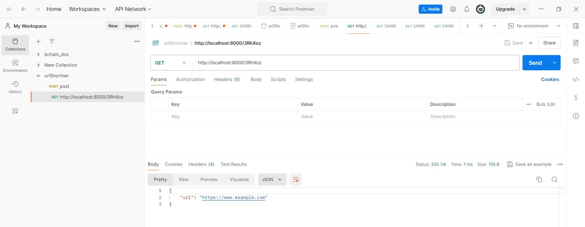
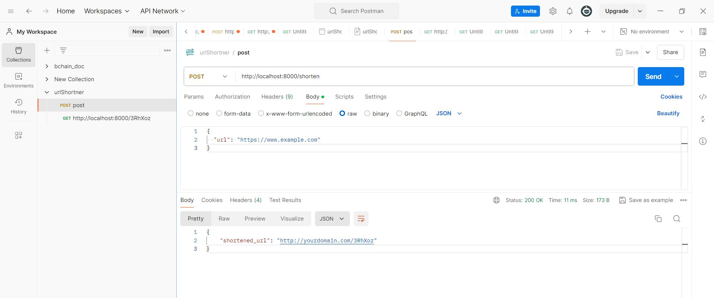

# URL Shortener API

A robust URL shortener API built with FastAPI and PostgreSQL, designed for simplicity and scalability.

## Table of Contents
1. [Features](#features)
2. [Tech Stack](#tech-stack)
3. [Project Structure](#project-structure)
4. [Installation](#installation)
5. [Configuration](#configuration)
6. [Usage](#usage)
7. [API Documentation](#api-documentation)
8. [Database Schema](#database-schema)
9. [Testing](#testing)
10. [Deployment](#deployment)
11. [Future Improvements](#future-improvements)
12. [Contributing](#contributing)
13. [License](#license)

## Features

- Generate short URLs from long URLs
- Redirect short URLs to their original long URLs
- FastAPI for high-performance asynchronous API development
- PostgreSQL for reliable and scalable data storage
- Simple and intuitive API design

## Tech Stack

- **FastAPI**: A modern, fast (high-performance) web framework for building APIs with Python 3.6+ based on standard Python type hints.
- **SQLAlchemy**: The Python SQL toolkit and Object-Relational Mapping (ORM) library.
- **PostgreSQL**: A powerful, open-source object-relational database system.
- **Pydantic**: Data validation and settings management using Python type annotations.
- **Uvicorn**: A lightning-fast ASGI server implementation, using uvloop and httptools.

## Project Structure

```
url-shortener-api/
│
├── main.py            # Main application file
├── requirements.txt   # Project dependencies
├── .env               # Environment variables (not in version control)
├── .gitignore         # Specifies intentionally untracked files to ignore
├── README.md          # Project documentation
│
├── tests/             # Test files
│   ├── test_main.py   # Tests for main application
│   └── test_utils.py  # Tests for utility functions
│
└── screenshots/       # Application screenshots
    ├── database_schema.png
    ├── api_testing.png
    └── database_stats.png
```

## Installation

1. Clone the repository:
   ```
   git clone https://github.com/yourusername/url-shortener-api.git
   cd url-shortener-api
   ```

2. Set up a virtual environment:
   ```
   python -m venv venv
   source venv/bin/activate  # On Windows, use `venv\Scripts\activate`
   ```

3. Install dependencies:
   ```
   pip install -r requirements.txt
   ```

4. Set up PostgreSQL and create a new database for the project.

5. Copy `.env.example` to `.env` and update the variables:
   ```
   cp .env.example .env
   ```
   Edit `.env` with your database credentials and other configuration.

## Configuration

The application uses environment variables for configuration. These can be set in the `.env` file:

- `DATABASE_URL`: PostgreSQL database URL
- `BASE_URL`: Base URL for the shortened links (default: http://localhost:8000)
- `SHORT_CODE_LENGTH`: Length of generated short codes (default: 6)

## Usage

1. Start the server:
   ```
   python main.py
   ```
   The API will be available at `http://localhost:8000`.

2. Use the API:
   - To create a short URL:
     ```
     POST /shorten
     Body: {"url": "https://www.example.com/very/long/url"}
     ```
   - To access a shortened URL:
     ```
     GET /{short_code}
     ```

## API Documentation

After starting the server, visit `http://localhost:8000/docs` for interactive API documentation powered by Swagger UI.

### Endpoints

1. `POST /shorten`
   - Description: Creates a short URL from a long URL
   - Request Body: `{"url": "https://www.example.com"}`
   - Response: `{"shortened_url": "http://localhost:8000/abc123"}`

2. `GET /{short_code}`
   - Description: Redirects to the original URL
   - Response: Redirects to the original URL or returns 404 if not found

## Database Schema

The `urls` table structure:

| Column       | Type    | Constraints       |
|--------------|---------|-------------------|
| id           | INTEGER | PRIMARY KEY       |
| original_url | VARCHAR | NOT NULL          |
| short_code   | VARCHAR | UNIQUE, NOT NULL  |


## Testing

Run the tests using pytest:

```
pytest
```

## Deployment

To deploy the application:

1. Set up a PostgreSQL database on your server.
2. Update the `.env` file with production settings.
3. Install dependencies: `pip install -r requirements.txt`
4. Run the application using a production ASGI server like Gunicorn:
   ```
   gunicorn main:app -w 4 -k uvicorn.workers.UvicornWorker
   ```

## Future Improvements

- [ ] Add user authentication for creating and managing URLs
- [ ] Implement rate limiting to prevent abuse
- [ ] Add analytics for URL clicks and geographic data
- [ ] Create a simple web interface for creating short URLs
- [ ] Implement custom short codes for premium users

## Contributing

Contributions are welcome! Please feel free to submit a Pull Request.

1. Fork the repository
2. Create your feature branch (`git checkout -b feature/AmazingFeature`)
3. Commit your changes (`git commit -m 'Add some AmazingFeature'`)
4. Push to the branch (`git push origin feature/AmazingFeature`)
5. Open a Pull Request

## License

This project is licensed under the MIT License - see the [LICENSE](LICENSE) file for details.

## Screenshots


*API testing using Postman*


*API testing using Postman*